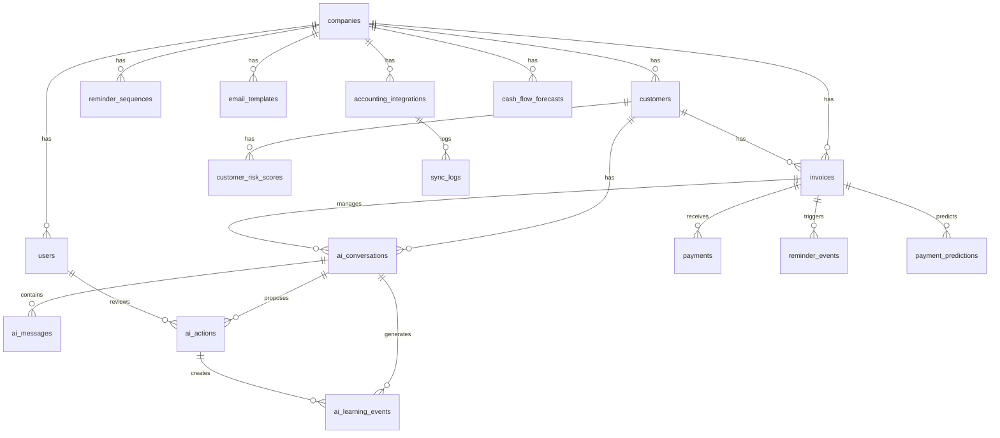

# Data Model - Receivable Notification System
## PostgreSQL Database Schema

**Version:** 1.0  
**Last Updated:** January 25, 2026  
**Database:** PostgreSQL 14+  
**Purpose:** Complete data model for AI-Native Receivable Notification System

---

## Table of Contents
1. [Core Entities](#core-entities)
2. [AI Layer Entities](#ai-layer-entities)
3. [Relationships](#relationships)
4. [Indexes and Constraints](#indexes-and-constraints)
5. [Production Readiness Recommendations](#production-readiness-recommendations)

---

## Core Entities

### Company
Multi-tenant company entity representing each business using the system.

```sql
CREATE TABLE companies (
    id UUID PRIMARY KEY DEFAULT gen_random_uuid(),
    name VARCHAR(255) NOT NULL,
    slug VARCHAR(100) UNIQUE NOT NULL,
    email VARCHAR(255) NOT NULL,
    default_payment_terms INTEGER NOT NULL DEFAULT 30,
    default_currency CHAR(3) NOT NULL DEFAULT 'EUR',
    eu_regulation_enabled BOOLEAN DEFAULT false,
    created_at TIMESTAMPTZ NOT NULL DEFAULT CURRENT_TIMESTAMP,
    updated_at TIMESTAMPTZ NOT NULL DEFAULT CURRENT_TIMESTAMP,
    
    CONSTRAINT valid_currency CHECK (default_currency ~ '^[A-Z]{3}$'),
    CONSTRAINT valid_payment_terms CHECK (default_payment_terms > 0 AND default_payment_terms <= 365)
);

CREATE INDEX idx_companies_slug ON companies(slug);
CREATE INDEX idx_companies_created_at ON companies(created_at);
```

### User
User accounts associated with companies.

```sql
CREATE TABLE users (
    id UUID PRIMARY KEY DEFAULT gen_random_uuid(),
    company_id UUID NOT NULL REFERENCES companies(id) ON DELETE CASCADE,
    email VARCHAR(255) UNIQUE NOT NULL,
    password_hash VARCHAR(255) NOT NULL,
    name VARCHAR(255) NOT NULL,
    timezone VARCHAR(50) DEFAULT 'UTC',
    email_notifications JSONB DEFAULT '{}',
    created_at TIMESTAMPTZ NOT NULL DEFAULT CURRENT_TIMESTAMP,
    last_login_at TIMESTAMPTZ,
    
    CONSTRAINT valid_email CHECK (email ~* '^[A-Za-z0-9._%+-]+@[A-Za-z0-9.-]+\.[A-Za-z]{2,}$')
);

CREATE INDEX idx_users_company_id ON users(company_id);
CREATE INDEX idx_users_email ON users(email);
CREATE INDEX idx_users_last_login ON users(last_login_at);
```

### Customer
Customer entities for each company.

```sql
CREATE TABLE customers (
    id UUID PRIMARY KEY DEFAULT gen_random_uuid(),
    company_id UUID NOT NULL REFERENCES companies(id) ON DELETE CASCADE,
    name VARCHAR(255) NOT NULL,
    email VARCHAR(255) NOT NULL,
    contact_person VARCHAR(255),
    default_payment_terms INTEGER,
    notes TEXT,
    
    -- AI enhancements
    risk_score INTEGER CHECK (risk_score >= 0 AND risk_score <= 100),
    risk_category VARCHAR(20) CHECK (risk_category IN ('low', 'medium', 'high', 'critical')),
    risk_updated_at TIMESTAMPTZ,
    ai_customer_summary TEXT,
    avg_days_to_pay DECIMAL(5,2),
    payment_reliability_score DECIMAL(3,2) CHECK (payment_reliability_score >= 0 AND payment_reliability_score <= 1),
    preferred_contact_channel VARCHAR(20) CHECK (preferred_contact_channel IN ('email', 'phone', 'linkedin')),
    preferred_contact_time JSONB,
    relationship_value_score DECIMAL(10,2),
    
    created_at TIMESTAMPTZ NOT NULL DEFAULT CURRENT_TIMESTAMP,
    updated_at TIMESTAMPTZ NOT NULL DEFAULT CURRENT_TIMESTAMP,
    
    CONSTRAINT valid_customer_email CHECK (email ~* '^[A-Za-z0-9._%+-]+@[A-Za-z0-9.-]+\.[A-Za-z]{2,}$')
);

CREATE INDEX idx_customers_company_id ON customers(company_id);
CREATE INDEX idx_customers_email ON customers(company_id, email);
CREATE INDEX idx_customers_risk_category ON customers(risk_category);
CREATE INDEX idx_customers_created_at ON customers(created_at);
```

### Invoice
Invoice tracking with AI enhancement fields.

```sql
CREATE TABLE invoices (
    id UUID PRIMARY KEY DEFAULT gen_random_uuid(),
    company_id UUID NOT NULL REFERENCES companies(id) ON DELETE CASCADE,
    customer_id UUID NOT NULL REFERENCES customers(id) ON DELETE RESTRICT,
    invoice_number VARCHAR(100) NOT NULL,
    amount DECIMAL(10,2) NOT NULL,
    currency CHAR(3) NOT NULL DEFAULT 'EUR',
    invoice_date DATE NOT NULL,
    payment_terms_days INTEGER NOT NULL DEFAULT 30,
    due_date DATE NOT NULL,
    status VARCHAR(20) NOT NULL CHECK (status IN ('pending', 'due_soon', 'overdue', 'paid')),
    file_url TEXT,
    last_reminder_date TIMESTAMPTZ,
    next_action_date TIMESTAMPTZ,
    reminder_sequence_step INTEGER DEFAULT 0,
    
    -- OCR fields
    ocr_processed BOOLEAN DEFAULT false,
    ocr_confidence_score DECIMAL(3,2) CHECK (ocr_confidence_score >= 0 AND ocr_confidence_score <= 1),
    ocr_extracted_data JSONB,
    
    -- Integration fields
    sevdesk_invoice_id VARCHAR(100),
    sevdesk_synced_at TIMESTAMPTZ,
    sevdesk_sync_status VARCHAR(20) DEFAULT 'not_synced' CHECK (sevdesk_sync_status IN ('not_synced', 'synced', 'sync_failed')),
    
    -- AI prediction fields
    ai_conversation_id UUID,
    payment_probability_7d DECIMAL(3,2) CHECK (payment_probability_7d >= 0 AND payment_probability_7d <= 1),
    payment_probability_30d DECIMAL(3,2) CHECK (payment_probability_30d >= 0 AND payment_probability_30d <= 1),
    expected_payment_date DATE,
    prediction_updated_at TIMESTAMPTZ,
    anomaly_flags JSONB,
    
    created_at TIMESTAMPTZ NOT NULL DEFAULT CURRENT_TIMESTAMP,
    updated_at TIMESTAMPTZ NOT NULL DEFAULT CURRENT_TIMESTAMP,
    
    CONSTRAINT valid_amount CHECK (amount > 0),
    CONSTRAINT valid_currency CHECK (currency ~ '^[A-Z]{3}$'),
    CONSTRAINT valid_payment_terms CHECK (payment_terms_days > 0 AND payment_terms_days <= 365),
    CONSTRAINT unique_invoice_per_company UNIQUE(company_id, invoice_number)
);

CREATE INDEX idx_invoices_company_id ON invoices(company_id);
CREATE INDEX idx_invoices_customer_id ON invoices(customer_id);
CREATE INDEX idx_invoices_status ON invoices(status);
CREATE INDEX idx_invoices_due_date ON invoices(due_date);
CREATE INDEX idx_invoices_sevdesk_id ON invoices(sevdesk_invoice_id);
CREATE INDEX idx_invoices_next_action ON invoices(next_action_date) WHERE status != 'paid';
CREATE INDEX idx_invoices_payment_prob ON invoices(payment_probability_7d, payment_probability_30d);
CREATE INDEX idx_invoices_ai_conversation ON invoices(ai_conversation_id);
```

### Payment
Payment tracking for invoices.

```sql
CREATE TABLE payments (
    id UUID PRIMARY KEY DEFAULT gen_random_uuid(),
    invoice_id UUID NOT NULL REFERENCES invoices(id) ON DELETE CASCADE,
    amount DECIMAL(10,2) NOT NULL,
    payment_date DATE NOT NULL,
    payment_method VARCHAR(20) NOT NULL CHECK (payment_method IN ('bank_transfer', 'check', 'cash', 'other')),
    source VARCHAR(20) NOT NULL CHECK (source IN ('manual', 'csv_import', 'api_sync')),
    notes TEXT,
    created_at TIMESTAMPTZ NOT NULL DEFAULT CURRENT_TIMESTAMP,
    
    CONSTRAINT valid_payment_amount CHECK (amount > 0)
);

CREATE INDEX idx_payments_invoice_id ON payments(invoice_id);
CREATE INDEX idx_payments_payment_date ON payments(payment_date);
CREATE INDEX idx_payments_created_at ON payments(created_at);
```

### ReminderEvent
Tracks reminder emails sent.

```sql
CREATE TABLE reminder_events (
    id UUID PRIMARY KEY DEFAULT gen_random_uuid(),
    invoice_id UUID NOT NULL REFERENCES invoices(id) ON DELETE CASCADE,
    template_type VARCHAR(20) NOT NULL CHECK (template_type IN ('friendly', 'firm')),
    sent_at TIMESTAMPTZ NOT NULL,
    recipient_email VARCHAR(255) NOT NULL,
    delivery_status VARCHAR(20) NOT NULL CHECK (delivery_status IN ('sent', 'failed', 'bounced', 'delivered', 'opened', 'clicked')),
    opened_at TIMESTAMPTZ,
    is_manual BOOLEAN DEFAULT false,
    created_at TIMESTAMPTZ NOT NULL DEFAULT CURRENT_TIMESTAMP
);

CREATE INDEX idx_reminder_events_invoice_id ON reminder_events(invoice_id);
CREATE INDEX idx_reminder_events_sent_at ON reminder_events(sent_at);
CREATE INDEX idx_reminder_events_delivery_status ON reminder_events(delivery_status);
```

### ReminderSequence
Defines reminder cadence for each company.

```sql
CREATE TABLE reminder_sequences (
    id UUID PRIMARY KEY DEFAULT gen_random_uuid(),
    company_id UUID NOT NULL REFERENCES companies(id) ON DELETE CASCADE,
    steps JSONB NOT NULL,
    created_at TIMESTAMPTZ NOT NULL DEFAULT CURRENT_TIMESTAMP,
    updated_at TIMESTAMPTZ NOT NULL DEFAULT CURRENT_TIMESTAMP,
    
    CONSTRAINT one_sequence_per_company UNIQUE(company_id)
);

CREATE INDEX idx_reminder_sequences_company_id ON reminder_sequences(company_id);
```

### EmailTemplate
Customizable email templates.

```sql
CREATE TABLE email_templates (
    id UUID PRIMARY KEY DEFAULT gen_random_uuid(),
    company_id UUID NOT NULL REFERENCES companies(id) ON DELETE CASCADE,
    template_type VARCHAR(20) NOT NULL CHECK (template_type IN ('friendly', 'firm')),
    subject VARCHAR(500) NOT NULL,
    body TEXT NOT NULL,
    created_at TIMESTAMPTZ NOT NULL DEFAULT CURRENT_TIMESTAMP,
    updated_at TIMESTAMPTZ NOT NULL DEFAULT CURRENT_TIMESTAMP,
    
    CONSTRAINT unique_template_per_company UNIQUE(company_id, template_type)
);

CREATE INDEX idx_email_templates_company_id ON email_templates(company_id);
```

### AccountingIntegration
Integration configurations for external accounting systems.

```sql
CREATE TABLE accounting_integrations (
    id UUID PRIMARY KEY DEFAULT gen_random_uuid(),
    company_id UUID NOT NULL REFERENCES companies(id) ON DELETE CASCADE,
    provider VARCHAR(50) NOT NULL CHECK (provider IN ('sevdesk', 'xero', 'lexoffice')),
    access_token TEXT NOT NULL,
    refresh_token TEXT,
    token_expires_at TIMESTAMPTZ,
    sync_direction VARCHAR(20) NOT NULL CHECK (sync_direction IN ('import', 'export', 'bidirectional')),
    auto_sync_enabled BOOLEAN DEFAULT false,
    auto_sync_time TIME DEFAULT '02:00:00',
    last_sync_at TIMESTAMPTZ,
    last_sync_status VARCHAR(20) CHECK (last_sync_status IN ('success', 'failed', 'partial')),
    last_sync_error TEXT,
    sync_config JSONB,
    created_at TIMESTAMPTZ NOT NULL DEFAULT CURRENT_TIMESTAMP,
    updated_at TIMESTAMPTZ NOT NULL DEFAULT CURRENT_TIMESTAMP
);

CREATE INDEX idx_accounting_integrations_company_id ON accounting_integrations(company_id);
CREATE INDEX idx_accounting_integrations_provider ON accounting_integrations(provider);
```

### SyncLog
Audit log for integration syncs.

```sql
CREATE TABLE sync_logs (
    id UUID PRIMARY KEY DEFAULT gen_random_uuid(),
    integration_id UUID NOT NULL REFERENCES accounting_integrations(id) ON DELETE CASCADE,
    sync_type VARCHAR(20) NOT NULL CHECK (sync_type IN ('manual', 'automatic')),
    direction VARCHAR(20) NOT NULL CHECK (direction IN ('import', 'export', 'bidirectional')),
    records_synced INTEGER DEFAULT 0,
    records_failed INTEGER DEFAULT 0,
    status VARCHAR(20) NOT NULL CHECK (status IN ('success', 'failed', 'partial')),
    error_message TEXT,
    started_at TIMESTAMPTZ NOT NULL,
    completed_at TIMESTAMPTZ,
    created_at TIMESTAMPTZ NOT NULL DEFAULT CURRENT_TIMESTAMP
);

CREATE INDEX idx_sync_logs_integration_id ON sync_logs(integration_id);
CREATE INDEX idx_sync_logs_started_at ON sync_logs(started_at);
CREATE INDEX idx_sync_logs_status ON sync_logs(status);
```

---

## AI Layer Entities

### AIConversation
Tracks AI-managed collection conversations for each invoice.

```sql
CREATE TABLE ai_conversations (
    id UUID PRIMARY KEY DEFAULT gen_random_uuid(),
    invoice_id UUID NOT NULL REFERENCES invoices(id) ON DELETE CASCADE,
    customer_id UUID NOT NULL REFERENCES customers(id) ON DELETE RESTRICT,
    status VARCHAR(20) NOT NULL CHECK (status IN ('active', 'paused', 'completed', 'escalated')),
    autonomy_level VARCHAR(20) NOT NULL CHECK (autonomy_level IN ('full', 'supervised', 'assisted')),
    current_stage VARCHAR(20) NOT NULL CHECK (current_stage IN ('initial_outreach', 'follow_up', 'negotiation', 'escalated', 'resolved')),
    total_messages_sent INTEGER DEFAULT 0,
    total_responses_received INTEGER DEFAULT 0,
    last_action_at TIMESTAMPTZ,
    next_action_at TIMESTAMPTZ,
    escalation_reason TEXT,
    outcome VARCHAR(20) CHECK (outcome IN ('paid', 'payment_plan', 'dispute', 'churned', 'written_off')),
    created_at TIMESTAMPTZ NOT NULL DEFAULT CURRENT_TIMESTAMP,
    updated_at TIMESTAMPTZ NOT NULL DEFAULT CURRENT_TIMESTAMP,
    
    CONSTRAINT valid_message_counts CHECK (total_messages_sent >= 0 AND total_responses_received >= 0)
);

CREATE INDEX idx_ai_conversations_invoice_id ON ai_conversations(invoice_id);
CREATE INDEX idx_ai_conversations_customer_id ON ai_conversations(customer_id);
CREATE INDEX idx_ai_conversations_status ON ai_conversations(status);
CREATE INDEX idx_ai_conversations_next_action ON ai_conversations(next_action_at) WHERE status = 'active';
CREATE INDEX idx_ai_conversations_outcome ON ai_conversations(outcome);
```

### AIMessage
Individual messages within AI conversations.

```sql
CREATE TABLE ai_messages (
    id UUID PRIMARY KEY DEFAULT gen_random_uuid(),
    conversation_id UUID NOT NULL REFERENCES ai_conversations(id) ON DELETE CASCADE,
    direction VARCHAR(20) NOT NULL CHECK (direction IN ('outbound', 'inbound')),
    channel VARCHAR(20) NOT NULL CHECK (channel IN ('email', 'phone_script', 'linkedin')),
    message_type VARCHAR(30) NOT NULL CHECK (message_type IN ('ai_generated', 'human_approved', 'human_written', 'customer_reply')),
    content TEXT NOT NULL,
    subject TEXT,
    sentiment_score DECIMAL(3,2) CHECK (sentiment_score >= -1 AND sentiment_score <= 1),
    intent_classification VARCHAR(100),
    confidence_score DECIMAL(3,2) CHECK (confidence_score >= 0 AND confidence_score <= 1),
    ai_reasoning TEXT,
    delivery_status VARCHAR(20) NOT NULL CHECK (delivery_status IN ('draft', 'approved', 'sent', 'delivered', 'failed', 'opened', 'clicked')),
    sent_at TIMESTAMPTZ,
    opened_at TIMESTAMPTZ,
    created_at TIMESTAMPTZ NOT NULL DEFAULT CURRENT_TIMESTAMP
);

CREATE INDEX idx_ai_messages_conversation_id ON ai_messages(conversation_id);
CREATE INDEX idx_ai_messages_direction ON ai_messages(direction);
CREATE INDEX idx_ai_messages_sent_at ON ai_messages(sent_at);
CREATE INDEX idx_ai_messages_delivery_status ON ai_messages(delivery_status);
```

### AIAction
Proposed AI actions requiring approval.

```sql
CREATE TABLE ai_actions (
    id UUID PRIMARY KEY DEFAULT gen_random_uuid(),
    conversation_id UUID NOT NULL REFERENCES ai_conversations(id) ON DELETE CASCADE,
    action_type VARCHAR(30) NOT NULL CHECK (action_type IN ('send_message', 'schedule_follow_up', 'offer_payment_plan', 'escalate', 'pause', 'resume', 'mark_paid')),
    status VARCHAR(30) NOT NULL CHECK (status IN ('pending_approval', 'approved', 'executed', 'rejected', 'cancelled')),
    ai_confidence DECIMAL(3,2) NOT NULL CHECK (ai_confidence >= 0 AND ai_confidence <= 1),
    ai_reasoning TEXT NOT NULL,
    human_reviewer_id UUID REFERENCES users(id),
    human_decision_at TIMESTAMPTZ,
    human_notes TEXT,
    executed_at TIMESTAMPTZ,
    created_at TIMESTAMPTZ NOT NULL DEFAULT CURRENT_TIMESTAMP
);

CREATE INDEX idx_ai_actions_conversation_id ON ai_actions(conversation_id);
CREATE INDEX idx_ai_actions_status ON ai_actions(status);
CREATE INDEX idx_ai_actions_created_at ON ai_actions(created_at);
CREATE INDEX idx_ai_actions_pending ON ai_actions(status, created_at) WHERE status = 'pending_approval';
```

### PaymentPrediction
ML-based payment probability predictions for invoices.

```sql
CREATE TABLE payment_predictions (
    id UUID PRIMARY KEY DEFAULT gen_random_uuid(),
    invoice_id UUID NOT NULL REFERENCES invoices(id) ON DELETE CASCADE,
    prediction_date DATE NOT NULL,
    prob_7_days DECIMAL(3,2) NOT NULL CHECK (prob_7_days >= 0 AND prob_7_days <= 1),
    prob_14_days DECIMAL(3,2) NOT NULL CHECK (prob_14_days >= 0 AND prob_14_days <= 1),
    prob_30_days DECIMAL(3,2) NOT NULL CHECK (prob_30_days >= 0 AND prob_30_days <= 1),
    prob_by_due_date DECIMAL(3,2) NOT NULL CHECK (prob_by_due_date >= 0 AND prob_by_due_date <= 1),
    expected_payment_date DATE NOT NULL,
    confidence_score DECIMAL(3,2) NOT NULL CHECK (confidence_score >= 0 AND confidence_score <= 1),
    model_version VARCHAR(50) NOT NULL,
    feature_importance JSONB,
    actual_payment_date DATE,
    created_at TIMESTAMPTZ NOT NULL DEFAULT CURRENT_TIMESTAMP
);

CREATE INDEX idx_payment_predictions_invoice_id ON payment_predictions(invoice_id);
CREATE INDEX idx_payment_predictions_prediction_date ON payment_predictions(prediction_date);
CREATE INDEX idx_payment_predictions_model_version ON payment_predictions(model_version);
CREATE UNIQUE INDEX idx_payment_predictions_unique ON payment_predictions(invoice_id, prediction_date);
```

### CustomerRiskScore
Customer credit risk assessment scores.

```sql
CREATE TABLE customer_risk_scores (
    id UUID PRIMARY KEY DEFAULT gen_random_uuid(),
    customer_id UUID NOT NULL REFERENCES customers(id) ON DELETE CASCADE,
    score_date DATE NOT NULL,
    risk_score INTEGER NOT NULL CHECK (risk_score >= 0 AND risk_score <= 100),
    risk_category VARCHAR(20) NOT NULL CHECK (risk_category IN ('low', 'medium', 'high', 'critical')),
    payment_history_score INTEGER NOT NULL CHECK (payment_history_score >= 0 AND payment_history_score <= 100),
    outstanding_balance_score INTEGER NOT NULL CHECK (outstanding_balance_score >= 0 AND outstanding_balance_score <= 100),
    trend_score INTEGER NOT NULL CHECK (trend_score >= 0 AND trend_score <= 100),
    external_signal_score INTEGER NOT NULL CHECK (external_signal_score >= 0 AND external_signal_score <= 100),
    contributing_factors JSONB,
    model_version VARCHAR(50) NOT NULL,
    created_at TIMESTAMPTZ NOT NULL DEFAULT CURRENT_TIMESTAMP
);

CREATE INDEX idx_customer_risk_scores_customer_id ON customer_risk_scores(customer_id);
CREATE INDEX idx_customer_risk_scores_score_date ON customer_risk_scores(score_date);
CREATE INDEX idx_customer_risk_scores_risk_category ON customer_risk_scores(risk_category);
CREATE UNIQUE INDEX idx_customer_risk_scores_unique ON customer_risk_scores(customer_id, score_date);
```

### CashFlowForecast
Predicted cash flow forecasts.

```sql
CREATE TABLE cash_flow_forecasts (
    id UUID PRIMARY KEY DEFAULT gen_random_uuid(),
    company_id UUID NOT NULL REFERENCES companies(id) ON DELETE CASCADE,
    forecast_date DATE NOT NULL,
    target_week_start DATE NOT NULL,
    expected_amount DECIMAL(12,2) NOT NULL,
    lower_bound DECIMAL(12,2) NOT NULL,
    upper_bound DECIMAL(12,2) NOT NULL,
    confidence_level DECIMAL(3,2) NOT NULL CHECK (confidence_level >= 0 AND confidence_level <= 1),
    contributing_invoices JSONB NOT NULL,
    actual_amount DECIMAL(12,2),
    model_version VARCHAR(50) NOT NULL,
    created_at TIMESTAMPTZ NOT NULL DEFAULT CURRENT_TIMESTAMP,
    
    CONSTRAINT valid_bounds CHECK (lower_bound <= expected_amount AND expected_amount <= upper_bound)
);

CREATE INDEX idx_cash_flow_forecasts_company_id ON cash_flow_forecasts(company_id);
CREATE INDEX idx_cash_flow_forecasts_forecast_date ON cash_flow_forecasts(forecast_date);
CREATE INDEX idx_cash_flow_forecasts_target_week ON cash_flow_forecasts(target_week_start);
CREATE UNIQUE INDEX idx_cash_flow_forecasts_unique ON cash_flow_forecasts(company_id, forecast_date, target_week_start);
```

### AILearningEvent
Learning signals for model improvement.

```sql
CREATE TABLE ai_learning_events (
    id UUID PRIMARY KEY DEFAULT gen_random_uuid(),
    event_type VARCHAR(30) NOT NULL CHECK (event_type IN ('action_outcome', 'user_edit', 'user_override', 'customer_feedback')),
    conversation_id UUID REFERENCES ai_conversations(id) ON DELETE CASCADE,
    action_id UUID REFERENCES ai_actions(id) ON DELETE CASCADE,
    original_value JSONB,
    outcome_value JSONB,
    learning_signal VARCHAR(20) NOT NULL CHECK (learning_signal IN ('positive', 'negative', 'neutral')),
    processed BOOLEAN DEFAULT false,
    created_at TIMESTAMPTZ NOT NULL DEFAULT CURRENT_TIMESTAMP
);

CREATE INDEX idx_ai_learning_events_event_type ON ai_learning_events(event_type);
CREATE INDEX idx_ai_learning_events_processed ON ai_learning_events(processed, created_at);
CREATE INDEX idx_ai_learning_events_conversation_id ON ai_learning_events(conversation_id);
```

---

## Relationships

### Entity Relationship Diagram



### Relationship Summary

| Parent Entity | Child Entity | Relationship | On Delete |
|---------------|--------------|--------------|-----------|
| companies | users | 1:N | CASCADE |
| companies | customers | 1:N | CASCADE |
| companies | invoices | 1:N | CASCADE |
| companies | reminder_sequences | 1:1 | CASCADE |
| companies | email_templates | 1:N | CASCADE |
| companies | accounting_integrations | 1:N | CASCADE |
| companies | cash_flow_forecasts | 1:N | CASCADE |
| customers | invoices | 1:N | RESTRICT |
| customers | ai_conversations | 1:N | RESTRICT |
| customers | customer_risk_scores | 1:N | CASCADE |
| invoices | payments | 1:N | CASCADE |
| invoices | reminder_events | 1:N | CASCADE |
| invoices | ai_conversations | 1:1 | CASCADE |
| invoices | payment_predictions | 1:N | CASCADE |
| ai_conversations | ai_messages | 1:N | CASCADE |
| ai_conversations | ai_actions | 1:N | CASCADE |
| ai_conversations | ai_learning_events | 1:N | CASCADE |
| ai_actions | ai_learning_events | 1:N | CASCADE |
| accounting_integrations | sync_logs | 1:N | CASCADE |
| users | ai_actions | 1:N | SET NULL |

---

## Indexes and Constraints

### Critical Indexes

```sql
-- Performance-critical composite indexes
CREATE INDEX idx_invoices_company_status_due ON invoices(company_id, status, due_date);
CREATE INDEX idx_invoices_customer_status ON invoices(customer_id, status);
CREATE INDEX idx_ai_conversations_active ON ai_conversations(status, next_action_at) WHERE status = 'active';
CREATE INDEX idx_payments_invoice_date ON payments(invoice_id, payment_date);

-- Full-text search indexes
CREATE INDEX idx_customers_name_trgm ON customers USING gin(name gin_trgm_ops);
CREATE INDEX idx_invoices_number_trgm ON invoices USING gin(invoice_number gin_trgm_ops);

-- JSONB indexes for querying
CREATE INDEX idx_email_notifications_jsonb ON users USING gin(email_notifications);
CREATE INDEX idx_ocr_data_jsonb ON invoices USING gin(ocr_extracted_data);
CREATE INDEX idx_anomaly_flags_jsonb ON invoices USING gin(anomaly_flags);
CREATE INDEX idx_feature_importance_jsonb ON payment_predictions USING gin(feature_importance);
```

### Check Constraints Summary

All critical business rules are enforced through database constraints:
- Amount validations (> 0)
- Percentage/probability validations (0-1 range)
- Score validations (0-100 range)
- Email format validations
- Currency format validations (ISO 4217)
- Enum validations for all status fields
- Uniqueness constraints for business keys

---

## Production Readiness Recommendations

### 1. **Security Enhancements**

#### Missing: Row-Level Security (RLS)
```sql
-- Enable RLS for multi-tenant isolation
ALTER TABLE invoices ENABLE ROW LEVEL SECURITY;
ALTER TABLE customers ENABLE ROW LEVEL SECURITY;
ALTER TABLE users ENABLE ROW LEVEL SECURITY;

-- Example policy
CREATE POLICY company_isolation_policy ON invoices
    USING (company_id = current_setting('app.current_company_id')::UUID);
```

#### Missing: Encryption at Rest
- **Recommendation:** Encrypt sensitive fields using `pgcrypto`
- Fields to encrypt: `password_hash`, `access_token`, `refresh_token`

```sql
-- Example for access tokens
CREATE EXTENSION IF NOT EXISTS pgcrypto;

ALTER TABLE accounting_integrations 
    ALTER COLUMN access_token TYPE BYTEA USING pgp_sym_encrypt(access_token, current_setting('app.encryption_key'));
```

#### Missing: Audit Trail
```sql
CREATE TABLE audit_logs (
    id UUID PRIMARY KEY DEFAULT gen_random_uuid(),
    table_name VARCHAR(100) NOT NULL,
    record_id UUID NOT NULL,
    action VARCHAR(20) NOT NULL CHECK (action IN ('INSERT', 'UPDATE', 'DELETE')),
    old_values JSONB,
    new_values JSONB,
    changed_by UUID REFERENCES users(id),
    changed_at TIMESTAMPTZ NOT NULL DEFAULT CURRENT_TIMESTAMP,
    ip_address INET,
    user_agent TEXT
);

CREATE INDEX idx_audit_logs_table_record ON audit_logs(table_name, record_id);
CREATE INDEX idx_audit_logs_changed_at ON audit_logs(changed_at);
CREATE INDEX idx_audit_logs_changed_by ON audit_logs(changed_by);
```

### 2. **Data Integrity Enhancements**

#### Missing: Soft Deletes
```sql
-- Add to all major tables
ALTER TABLE customers ADD COLUMN deleted_at TIMESTAMPTZ;
ALTER TABLE invoices ADD COLUMN deleted_at TIMESTAMPTZ;
ALTER TABLE users ADD COLUMN deleted_at TIMESTAMPTZ;

-- Update indexes to exclude soft-deleted records
CREATE INDEX idx_customers_active ON customers(company_id) WHERE deleted_at IS NULL;
CREATE INDEX idx_invoices_active ON invoices(company_id, status) WHERE deleted_at IS NULL;
```

#### Missing: Optimistic Locking
```sql
-- Add version columns for concurrent update protection
ALTER TABLE invoices ADD COLUMN version INTEGER DEFAULT 1;
ALTER TABLE ai_conversations ADD COLUMN version INTEGER DEFAULT 1;
ALTER TABLE customers ADD COLUMN version INTEGER DEFAULT 1;

-- Application must check version on updates
-- UPDATE invoices SET status = 'paid', version = version + 1 
-- WHERE id = ? AND version = ?
```

### 3. **Performance Enhancements**

#### Missing: Partitioning Strategy
```sql
-- Partition historical tables by date
CREATE TABLE reminder_events_2026_q1 PARTITION OF reminder_events
    FOR VALUES FROM ('2026-01-01') TO ('2026-04-01');

CREATE TABLE sync_logs_2026_q1 PARTITION OF sync_logs
    FOR VALUES FROM ('2026-01-01') TO ('2026-04-01');

-- Partition large AI tables
CREATE TABLE ai_messages_2026_01 PARTITION OF ai_messages
    FOR VALUES FROM ('2026-01-01') TO ('2026-02-01');
```

#### Missing: Materialized Views for Analytics
```sql
-- Customer payment behavior summary
CREATE MATERIALIZED VIEW customer_payment_stats AS
SELECT 
    c.id,
    c.company_id,
    COUNT(i.id) as total_invoices,
    AVG(p.payment_date - i.due_date) as avg_days_late,
    SUM(i.amount) as total_billed,
    SUM(p.amount) as total_paid,
    MAX(i.due_date) as last_invoice_due_date
FROM customers c
LEFT JOIN invoices i ON i.customer_id = c.id
LEFT JOIN payments p ON p.invoice_id = i.id
WHERE c.deleted_at IS NULL
GROUP BY c.id, c.company_id;

CREATE UNIQUE INDEX ON customer_payment_stats(id);
CREATE INDEX ON customer_payment_stats(company_id);

-- Refresh nightly
REFRESH MATERIALIZED VIEW CONCURRENTLY customer_payment_stats;
```

### 4. **Data Validation Enhancements**

#### Missing: Advanced Business Rules
```sql
-- Ensure payment doesn't exceed invoice amount
CREATE OR REPLACE FUNCTION validate_payment_amount()
RETURNS TRIGGER AS $$
BEGIN
    IF (SELECT COALESCE(SUM(amount), 0) + NEW.amount 
        FROM payments 
        WHERE invoice_id = NEW.invoice_id) > 
       (SELECT amount FROM invoices WHERE id = NEW.invoice_id) THEN
        RAISE EXCEPTION 'Payment amount exceeds invoice total';
    END IF;
    RETURN NEW;
END;
$$ LANGUAGE plpgsql;

CREATE TRIGGER check_payment_amount
    BEFORE INSERT ON payments
    FOR EACH ROW EXECUTE FUNCTION validate_payment_amount();
```

#### Missing: Data Quality Constraints
```sql
-- Ensure invoice date is not in future
ALTER TABLE invoices ADD CONSTRAINT invoice_date_not_future 
    CHECK (invoice_date <= CURRENT_DATE);

-- Ensure due date is after invoice date
ALTER TABLE invoices ADD CONSTRAINT due_after_invoice 
    CHECK (due_date >= invoice_date);

-- Ensure payment date is not before invoice date
ALTER TABLE payments ADD CONSTRAINT payment_after_invoice
    CHECK (payment_date >= (SELECT invoice_date FROM invoices WHERE id = invoice_id));
```

### 5. **Monitoring & Observability**

#### Missing: Statistics Tables
```sql
CREATE TABLE system_metrics (
    id UUID PRIMARY KEY DEFAULT gen_random_uuid(),
    metric_name VARCHAR(100) NOT NULL,
    metric_value DECIMAL(15,2) NOT NULL,
    metric_unit VARCHAR(50),
    company_id UUID REFERENCES companies(id),
    recorded_at TIMESTAMPTZ NOT NULL DEFAULT CURRENT_TIMESTAMP
);

CREATE INDEX idx_system_metrics_name_date ON system_metrics(metric_name, recorded_at);
CREATE INDEX idx_system_metrics_company ON system_metrics(company_id, recorded_at);
```

#### Missing: Health Check View
```sql
CREATE VIEW system_health AS
SELECT 
    'total_companies' as metric,
    COUNT(*) as value
FROM companies
UNION ALL
SELECT 
    'active_invoices',
    COUNT(*)
FROM invoices
WHERE status != 'paid' AND deleted_at IS NULL
UNION ALL
SELECT 
    'ai_conversations_active',
    COUNT(*)
FROM ai_conversations
WHERE status = 'active';
```

### 6. **Disaster Recovery**

#### Missing: Point-in-Time Recovery Setup
```sql
-- Enable continuous archiving
-- Add to postgresql.conf:
-- wal_level = replica
-- archive_mode = on
-- archive_command = 'cp %p /archive/%f'
```

#### Missing: Backup Metadata
```sql
CREATE TABLE backup_history (
    id UUID PRIMARY KEY DEFAULT gen_random_uuid(),
    backup_type VARCHAR(20) CHECK (backup_type IN ('full', 'incremental', 'differential')),
    backup_location TEXT NOT NULL,
    backup_size_bytes BIGINT,
    started_at TIMESTAMPTZ NOT NULL,
    completed_at TIMESTAMPTZ,
    status VARCHAR(20) CHECK (status IN ('running', 'completed', 'failed')),
    error_message TEXT
);
```

### 7. **Scalability Considerations**

#### Missing: Connection Pooling Configuration
```sql
-- Add connection pooling limits
-- Recommended: Use PgBouncer or connection pooling in application

-- Monitor connection usage
CREATE VIEW connection_stats AS
SELECT 
    datname,
    usename,
    COUNT(*) as connections,
    MAX(state) as state
FROM pg_stat_activity
GROUP BY datname, usename;
```

#### Missing: Auto-vacuum Tuning
```sql
-- Adjust autovacuum for high-traffic tables
ALTER TABLE invoices SET (autovacuum_vacuum_scale_factor = 0.05);
ALTER TABLE ai_messages SET (autovacuum_vacuum_scale_factor = 0.05);
ALTER TABLE payments SET (autovacuum_vacuum_scale_factor = 0.1);
```

### 8. **Compliance & GDPR**

#### Missing: Data Retention Policies
```sql
CREATE TABLE data_retention_policies (
    id UUID PRIMARY KEY DEFAULT gen_random_uuid(),
    table_name VARCHAR(100) NOT NULL,
    retention_days INTEGER NOT NULL,
    deletion_logic TEXT,
    last_cleanup_at TIMESTAMPTZ,
    enabled BOOLEAN DEFAULT true
);

-- Example: Delete old reminder events after 2 years
INSERT INTO data_retention_policies (table_name, retention_days, deletion_logic)
VALUES ('reminder_events', 730, 'DELETE FROM reminder_events WHERE sent_at < NOW() - INTERVAL ''730 days''');
```

#### Missing: Personal Data Inventory
```sql
CREATE TABLE personal_data_fields (
    id UUID PRIMARY KEY DEFAULT gen_random_uuid(),
    table_name VARCHAR(100) NOT NULL,
    column_name VARCHAR(100) NOT NULL,
    data_category VARCHAR(50), -- 'PII', 'Financial', 'Contact'
    requires_consent BOOLEAN DEFAULT false,
    can_be_exported BOOLEAN DEFAULT true,
    can_be_deleted BOOLEAN DEFAULT true
);
```

### 9. **API Rate Limiting**

#### Missing: Rate Limit Tracking
```sql
CREATE TABLE api_rate_limits (
    id UUID PRIMARY KEY DEFAULT gen_random_uuid(),
    company_id UUID REFERENCES companies(id) ON DELETE CASCADE,
    endpoint VARCHAR(200) NOT NULL,
    request_count INTEGER DEFAULT 0,
    window_start TIMESTAMPTZ NOT NULL,
    window_end TIMESTAMPTZ NOT NULL,
    limit_exceeded BOOLEAN DEFAULT false
);

CREATE INDEX idx_api_rate_limits_company_window ON api_rate_limits(company_id, window_start);
```

### 10. **Feature Flags & A/B Testing**

#### Missing: Feature Flag System
```sql
CREATE TABLE feature_flags (
    id UUID PRIMARY KEY DEFAULT gen_random_uuid(),
    flag_name VARCHAR(100) UNIQUE NOT NULL,
    description TEXT,
    enabled BOOLEAN DEFAULT false,
    rollout_percentage INTEGER DEFAULT 0 CHECK (rollout_percentage >= 0 AND rollout_percentage <= 100),
    target_companies UUID[],
    created_at TIMESTAMPTZ NOT NULL DEFAULT CURRENT_TIMESTAMP,
    updated_at TIMESTAMPTZ NOT NULL DEFAULT CURRENT_TIMESTAMP
);

CREATE INDEX idx_feature_flags_enabled ON feature_flags(enabled);
```

---

## Summary of Missing Components

### Critical (Must Have for Production)
1. ✅ Row-Level Security for multi-tenant isolation
2. ✅ Audit trail for compliance
3. ✅ Soft deletes for data recovery
4. ✅ Encryption for sensitive fields
5. ✅ Advanced business rule validation
6. ✅ Connection pooling configuration
7. ✅ Backup and recovery procedures

### Important (Should Have)
8. ✅ Optimistic locking for concurrency
9. ✅ Partitioning for large tables
10. ✅ Materialized views for analytics
11. ✅ Data retention policies (GDPR)
12. ✅ System metrics and monitoring
13. ✅ Rate limiting infrastructure

### Nice to Have (Could Have)
14. ✅ Feature flag system
15. ✅ A/B testing infrastructure
16. ✅ Personal data inventory for GDPR
17. ✅ Advanced monitoring dashboards

---

## Migration Strategy

### Phase 1: Core Schema (Week 1)
- Deploy all base tables
- Create essential indexes
- Set up foreign key constraints

### Phase 2: Security (Week 2)
- Enable RLS policies
- Implement encryption
- Add audit logging

### Phase 3: Performance (Week 3)
- Add partitioning
- Create materialized views
- Optimize indexes

### Phase 4: Compliance (Week 4)
- Implement soft deletes
- Add retention policies
- Set up GDPR tooling

### Phase 5: Monitoring (Ongoing)
- Deploy health checks
- Set up metrics collection
- Configure alerts

---

## Database Configuration Recommendations

```sql
-- Recommended PostgreSQL settings for production

-- Memory
shared_buffers = 4GB                  -- 25% of RAM
effective_cache_size = 12GB           -- 75% of RAM
work_mem = 50MB                       -- For sorting/hashing
maintenance_work_mem = 1GB            -- For VACUUM, CREATE INDEX

-- Checkpoints
checkpoint_timeout = 15min
max_wal_size = 4GB
min_wal_size = 1GB
checkpoint_completion_target = 0.9

-- Query Planning
random_page_cost = 1.1                -- For SSD
effective_io_concurrency = 200        -- For SSD

-- Connections
max_connections = 200
```

---

**Document Status:** Ready for review  
**Next Steps:** 
1. Review with engineering team
2. Prioritize production enhancements
3. Create migration scripts
4. Set up monitoring and alerting
